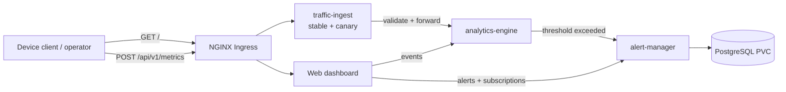

# Advanced Network Observability

A Kubernetes observability capstone that receives network-device telemetry,
detects latency anomalies, persists alerts and subscriptions, and presents
correlated events through an operator dashboard.

Repository: <https://github.com/quyenhl16/ckad-advanced-observability>

> Start here for the project flow and the shortest path to a working deployment.
> Use the [operations guide](docs/operations-guide.md) for complete cleanup,
> Ingress, persistence, canary, Helm and troubleshooting procedures.

## Business domain and user story

Network operators need one place to observe routers, switches, servers,
firewalls and access points. As an operator, I can submit a device metric, have
it evaluated against a latency threshold, persist an alert when the threshold
is exceeded, notify matching subscribers and inspect the correlated trace in a
web dashboard.

## Business flow



One accepted metric receives a `trace_id`. `analytics-engine` records an event;
latency above `150 ms` creates a durable alert in PostgreSQL. The same trace ID
links ingestion, analysis and alert data in the dashboard.

## Services

| Service | Responsibility | Port | Data ownership |
|---|---|---:|---|
| `traffic-ingest` | Validate metrics and start the trace | 8080 | Stateless |
| `analytics-engine` | Evaluate thresholds and expose recent events | 8081 | Pod-local event stream |
| `alert-manager` | Manage alerts, users, subscriptions and notifications | 8082 | PostgreSQL schema |
| `observability-frontend` | Render the operator dashboard and forms | 8083 | Stateless |

PostgreSQL is supporting infrastructure owned by `alert-manager`, not a fifth
core microservice. Communication is synchronous HTTP over Kubernetes DNS. See
[architecture.md](docs/architecture.md) for boundaries, contracts, data
ownership and failure behavior.

## Kubernetes design at a glance

- Four Go services, five Deployments including canary, one PostgreSQL
  StatefulSet and one health-audit CronJob.
- Nginx ambassador, init containers, log sidecars and shared `emptyDir` volumes.
- Stable/canary Service traffic, rolling updates, HPA, PDB and health probes.
- Runtime Secret generation, ConfigMaps, non-root security contexts, RBAC,
  ResourceQuota and LimitRange.
- Default-deny NetworkPolicies with explicit application and DNS flows.
- Kustomize `dev`/`prod` overlays plus an independent Helm chart for every
  application service and PostgreSQL.
- Retained local PV/PVC for PostgreSQL on `node-2`.

The complete requirement-to-evidence map is in
[ckad-checklist.md](docs/ckad-checklist.md).

## Prerequisites

- Kubernetes 1.35.x or the instructor-assigned version.
- A policy-capable CNI with working cross-node Pod networking.
- Nginx Ingress controller and an IngressClass named `nginx`.
- Metrics Server with an available `metrics.k8s.io` API.
- A default dynamic StorageClass for cluster prerequisites; PostgreSQL itself
  demonstrates a static local StorageClass and PV.
- A node named `node-2` with `/var/lib/observability-postgres` prepared.
- `kubectl`, Helm 3, Bash, and Docker or Podman.

Quick prerequisite check:

```bash
kubectl get nodes
kubectl get ingressclass
kubectl get apiservice v1beta1.metrics.k8s.io
kubectl top nodes
kubectl get storageclass
helm version --short
```

## Build images

Each service has a non-root multi-stage Dockerfile under `services/`. Use an
immutable version or Git SHA instead of `latest`.

```bash
chmod +x scripts/*.sh

IMAGE_TAG=1.0.0 \
REGISTRY_PREFIX=registry.example.com/team \
CONTAINER_ENGINE=docker \
./scripts/build.sh
```

## Deploy

The deployment script generates the Kubernetes Secret from environment values;
credentials are not committed to Git.

```bash
export POSTGRES_PASSWORD='replace-with-a-strong-password'
export ALERT_API_KEY='replace-with-a-different-strong-value'

./scripts/deploy.sh \
  --cluster generic \
  --overlay prod \
  --registry registry.example.com/team \
  --tag 1.0.0 \
  --canary-tag 1.1.0
```

For a local kind cluster:

```bash
./scripts/deploy.sh \
  --cluster kind \
  --cluster-name observability \
  --overlay dev \
  --tag 1.0.0 \
  --canary-tag 1.1.0
```

Full cleanup/redeploy and manual Kustomize procedures are documented in the
[operations guide](docs/operations-guide.md#full-cleanup-and-redeploy).

To deploy the same application as six Helm releases (platform controls plus
five runtime components) in the main namespace:

```bash
./scripts/cleanup.sh --confirm advanced-observability
export POSTGRES_PASSWORD='replace-with-a-strong-password'
export ALERT_API_KEY='replace-with-a-different-strong-value'
./scripts/deploy-helm.sh \
  --registry registry.example.com/team \
  --tag 1.0.0 --canary-tag 1.1.0 --profile prod
./scripts/verify-helm.sh --live
```

See [helm/README.md](helm/README.md) for chart dependencies and per-service
upgrade, rollback and uninstall commands.

## Verify and access

Validate rollouts, Service endpoints, storage and all capstone requirements:

```bash
./scripts/smoke-test.sh
./scripts/verify-requirements.sh --overlay prod \
  --report requirement-verification.txt

kubectl get pods,svc,endpointslices,hpa,ingress,pvc \
  -n advanced-observability
```

Resolve the Ingress endpoint and test the two public flows:

```bash
NODE_IP="$(kubectl get node node-1 -o jsonpath='{.status.addresses[?(@.type=="InternalIP")].address}')"
INGRESS_PORT="$(kubectl get service ingress-nginx-controller -n ingress-nginx -o jsonpath='{.spec.ports[?(@.name=="http")].nodePort}')"

# Dashboard: expect HTTP 200
curl -i -H 'Host: observability.local' \
  "http://${NODE_IP}:${INGRESS_PORT}/"

# Metric pipeline: expect HTTP 202 and a trace_id
curl -i -H 'Host: observability.local' \
  -H 'Content-Type: application/json' \
  -d '{"device_type":"router","device_id":"readme-check","cpu_usage_percent":65,"memory_usage_percent":58,"temperature_celsius":52,"latency_ms":220,"packet_loss_percent":1}' \
  "http://${NODE_IP}:${INGRESS_PORT}/api/v1/metrics"
```

Add `NODE_IP observability.local` to the browser machine's hosts file, then
open `http://observability.local:INGRESS_PORT/`. To populate the dashboard:

```bash
./scripts/generate-traces.sh
```

The generator submits 300 metrics by default and writes every returned trace ID
to a timestamped CSV under `data/`. It creates 264 one-request devices followed
by five history devices with 5, 6, 7, 8 and 10 requests, so their complete
history remains visible in the dashboard's latest-100 event window.

## Essential operations

### Clear PostgreSQL data

Delete every row from the application database while retaining its schema,
roles and credentials. This operation creates no backup and requires an
explicit confirmation token:

```bash
chmod +x scripts/clear-database.sh
./scripts/clear-database.sh --confirm DELETE-ALL-DATA
```

The script keeps all workloads running, truncates every non-system table,
restarts its sequences and verifies zero rows inside the cleanup transaction.
New rows can appear immediately afterward if traffic remains active. Analytics
event history is separate because it lives in Pod-local `emptyDir`. See the
[operations guide](docs/operations-guide.md#clear-postgresql-data).

### Rolling update and rollback

```bash
kubectl set image deployment/traffic-ingest \
  app=registry.example.com/team/traffic-ingest:1.0.1 \
  -n advanced-observability
kubectl rollout status deployment/traffic-ingest -n advanced-observability
kubectl rollout history deployment/traffic-ingest -n advanced-observability
kubectl rollout undo deployment/traffic-ingest -n advanced-observability
```

## Canary demonstration

The stable and canary Deployments share the `traffic-ingest` Service. Inspect
their endpoints, promote a validated image, or remove canary traffic:

```bash
kubectl get pods -n advanced-observability -l app=traffic-ingest \
  -L deployment-track,app.kubernetes.io/version
kubectl set image deployment/traffic-ingest \
  app=registry.example.com/team/traffic-ingest:1.1.0 \
  -n advanced-observability
kubectl scale deployment/traffic-ingest-canary --replicas=0 \
  -n advanced-observability
```

### Helm workflow

```bash
./scripts/deploy-helm.sh --registry registry.example.com/team \
  --tag 1.0.0 --canary-tag 1.1.0 --profile prod
./scripts/verify-helm.sh --live

helm upgrade traffic-ingest helm/traffic-ingest \
  -n advanced-observability --reuse-values --set-string image.tag=1.0.1
helm history traffic-ingest -n advanced-observability
helm rollback traffic-ingest 1 -n advanced-observability
```

### Debug essentials

```bash
kubectl logs deployment/traffic-ingest -n advanced-observability -c app
kubectl describe pod POD_NAME -n advanced-observability
kubectl get events -n advanced-observability --sort-by=.metadata.creationTimestamp
kubectl top pods -n advanced-observability --containers
```

See the [operations guide](docs/operations-guide.md) for complete Ingress,
PVC, canary, Helm, cleanup and debugging runbooks.

## Demo script

Run the guided cluster inspection and requirement evidence collection:

```bash
./scripts/demo.sh
./scripts/verify-requirements.sh --overlay prod
```

The repository also contains 20 hands-on CKAD exercises. See the
[five-day lab guide](labs/README.md) and generate per-day verification reports
with `./labs/verify-all.sh --report-dir lab-verification-reports`.

## Self-assessment against the 50/50 review rubric

This project is self-assessed against the same review model used in the sample
trainee feedback: CKAD 50%, Microservices 50%, with a pass threshold of 90.
This is repository evidence, not an instructor-issued grade. The live score
remains conditional on the assigned cluster and a successful fresh deployment.

| Pillar | Maximum | Self-assessed | Main deduction |
|---|---:|---:|---|
| CKAD | 50 | **48** | Live cluster prerequisites, cross-node networking and fresh Helm evidence must still be demonstrated |
| Microservices | 50 | **46** | No retry/circuit-breaker/idempotency layer and no external trace exporter |
| **Total** | **100** | **94 — projected pass** | Official result remains subject to instructor review and live demo |

Repository verification currently reports **34/34 PASS** in static mode, and
the Go unit/integration test suite passes. All six service/platform Helm charts
have also been linted and rendered with Helm v4.2.3.

### Automatic-fail safeguards

| Condition | Status | Evidence |
|---|---|---|
| Fewer than three independently deployable services | **Clear** | Four separately built and deployed Go services |
| No Kubernetes Deployments | **Clear** | Four core Deployments plus the traffic-ingest canary |
| Plaintext application Secrets committed to Git | **Clear** | Runtime `observability-secrets` is generated from environment variables; manifests contain references only |
| No external exposure | **Clear** | Multi-path Ingress plus NodePort fallbacks for ingest and frontend |
| Pods cannot be shown Ready in the assigned namespace | **Live-gated** | Must pass `./scripts/verify-helm.sh --live` after every clean deployment |

### Required CKAD checklist

| ID | Result | Project evidence |
|---|---|---|
| D1 | **PASS** | Four service-specific multi-stage, non-root Dockerfiles with explicit tags |
| D2 | **PASS** | Deployments, PostgreSQL StatefulSet and health-audit CronJob |
| D3 | **PASS** | Config init container, log sidecar and Nginx ambassador |
| D4 | **PASS** | Generated configuration and logs shared through `emptyDir` |
| D5 | **PASS** | Retained local PV/PVC mounted by PostgreSQL on `node-2` |
| D6 | **PASS** | Application, version and stable/canary track labels |
| P1 | **PASS** | Every long-running application service uses a Deployment |
| P2 | **PASS** | Zero-unavailable rolling update and documented status/history/undo workflow |
| P3 | **PASS** | Stable and canary Deployments share the traffic-ingest Service |
| P4 | **PASS** | CPU HPA scales stable ingest between 2 and 6 replicas at 60% |
| P5 | **PASS** | Kustomize base with committed dev and prod overlays |
| P6 | **PASS** | Six Helm charts cover platform controls, database and all four services; upgrade/history/rollback documented |
| C1 | **PASS** | ConfigMaps injected through environment references and mounted volumes |
| C2 | **PASS** | Secrets created at deploy time; no Secret values committed in manifests |
| C3 | **PASS** | Non-root, RuntimeDefault seccomp, drop ALL, no escalation and read-only root filesystems |
| C4 | **PASS** | Least-privilege audit ServiceAccount, Role and RoleBinding; application token mounting disabled |
| C5 | **PASS** | Namespace ResourceQuota and LimitRange |
| C6 | **PASS** | Requests and limits on application, init, sidecar, database and CronJob containers |
| N1 | **PASS** | Stable ClusterIP DNS and a headless PostgreSQL Service |
| N2 | **PASS** | Ingress and NodePort external exposure |
| N3 | **PASS** | `/api/v1/metrics` and `/` route to different Services |
| N4 | **PASS*** | Default deny plus explicit DNS and application-flow rules; the live verifier also expects a policy named `allow-dns` |
| N5 | **PASS** | Smoke test fails if any core Service has no EndpointSlice address |
| O1 | **PASS** | Liveness probes on every application workload and PostgreSQL |
| O2 | **PASS** | Readiness probes on every application workload and PostgreSQL |
| O3 | **PASS** | Startup probes on stable and canary application Deployments |
| O4 | **PASS** | Logs, describe, events, top, endpoint, HPA and PVC troubleshooting runbook |
| O5 | **PASS** | Stable Kubernetes workload, networking, autoscaling, batch, policy, RBAC and storage APIs |

`N4` is satisfied semantically because Helm service policies include UDP/TCP
53 egress directly. For compatibility with the name-based verifier, deploy the
separate `allow-dns` policy documented by the project or include it in the
platform release.

### Microservices checklist and score

| Area | Maximum | Score | Evidence |
|---|---:|---:|---|
| Bounded contexts and service count | 10 | **10** | Ingestion, analytics, alerting and operator presentation have separate responsibilities |
| Independent deployability | 8 | **8** | Separate commands, Dockerfiles, images, Deployments and Helm releases |
| API contracts and health | 8 | **7** | Real HTTP/JSON handlers, validation and health endpoints; no formal OpenAPI contract |
| Data ownership and communication | 12 | **10** | Only alert-manager owns PostgreSQL; other services are stateless or own Pod-local events; HTTP-only architecture is documented honestly |
| DNS, gateway and east-west flow | 6 | **6** | Ingress gateway, stable Service DNS and NetworkPolicy-restricted calls |
| Pattern depth and coupling | 6 | **5** | Real trace propagation, persistence, notification and Kubernetes patterns; resilience layer remains limited |
| **Microservices subtotal** | **50** | **46** | |

Unlike the sample feedback project, this implementation does not claim NATS,
Redis or polyglot persistence that is absent from the code. The business flow
is real: ingest validates a metric, analytics evaluates the threshold,
alert-manager persists qualifying alerts and dispatches matching subscriber
notifications, and the frontend reads those APIs.

### Evidence still required for the official live result

Run these commands after a clean Helm deployment and keep the generated report:

```bash
./scripts/verify-helm.sh --live
./scripts/smoke-test.sh
./scripts/verify-requirements.sh --overlay prod \
  --report requirement-verification.txt

kubectl get pods,svc,endpointslices,hpa,ingress,pvc,networkpolicy \
  -n advanced-observability -o wide
kubectl get ingressclass
kubectl get apiservice v1beta1.metrics.k8s.io
kubectl top nodes
kubectl top pods -n advanced-observability --containers
```

The live acceptance is not complete if the IngressClass or Metrics API is
missing, a Service has no endpoint, Pods are not Ready, or Calico cannot carry
traffic between Pods scheduled on different nodes.

## Repository map

| Path | Purpose |
|---|---|
| `cmd/`, `internal/` | Go service entrypoints and domain/application adapters |
| `services/` | Service-specific multi-stage Dockerfiles |
| `deployments/` | Kustomize base, overlays and Kubernetes manifests |
| `helm/` | Independent charts for the database and all four application services |
| `scripts/` | Build, deploy, cleanup, smoke, trace and verification automation |
| `labs/` | Five days of hands-on CKAD labs and verifiers |
| `docs/` | Architecture, requirements, proposal and detailed operations |

## Documentation

- [Operations guide](docs/operations-guide.md): complete command reference and
  troubleshooting runbook.
- [Architecture](docs/architecture.md): boundaries, communication contracts,
  Kubernetes design and failure behavior.
- [CKAD checklist](docs/ckad-checklist.md): requirement-to-evidence mapping.
- [Project proposal](docs/project-proposal.md): original scope and stack.
- [Labs](labs/README.md): execution order and per-day verification.

## Known limitations

- `analytics-engine` stores recent events in Pod-local `emptyDir`; restarting
  the Pod removes event history.
- PostgreSQL demonstrates persistence but not database high availability; its
  local PV pins it to `node-2`.
- Canary distribution is replica-based rather than weighted traffic splitting.
- SMTP defaults to log-only notifications.
- Ingress uses HTTP; TLS and cert-manager are outside the capstone scope.
