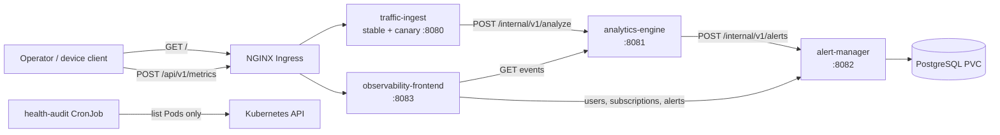

# Architecture

## Context

Advanced Network Observability receives telemetry from network devices and
turns high-latency samples into durable, subscribable alerts. The service
boundaries follow business capabilities rather than technical layers.

## Service ownership

| Component | Bounded context | Data ownership |
|---|---|---|
| `traffic-ingest` | Metric intake and validation | Stateless |
| `analytics-engine` | Threshold evaluation and recent event queries | Pod-local event stream; replaceable by a time-series store |
| `alert-manager` | Alerts, users, subscriptions and notifications | Own PostgreSQL schema and migrations |
| `observability-frontend` | Operator presentation and form workflows | Stateless |
| `health-audit` | Periodic Kubernetes workload health inventory | No persistent data; structured logs only |

Each service is a separate Go command and image. Updating one service does not
require rebuilding the other images. The shared Go module contains reusable
domain and platform packages but does not merge the runtime processes.

## Communication contracts

All current calls are synchronous HTTP. Kubernetes DNS names are externalized
through `observability-config`:

- `http://analytics-engine:8081`
- `http://alert-manager:8082`
- `observability-db:5432`

Long-running services expose `/health/live` and `/health/ready`. Internal alert
creation uses `ALERT_API_KEY` from a Kubernetes Secret. Application logs are
JSON on stdout; Nginx access logs are shared through `emptyDir` and tailed by a
sidecar.

## Kubernetes design

- Stable `traffic-ingest` Pods run behind an Nginx ambassador and scale with
  HPA. A direct single-container canary Deployment shares the same Service.
- Every core Deployment uses immutable version labels and explicit image tags.
- A default-deny policy is supplemented with DNS and exact application flow
  policies.
- PostgreSQL uses a StatefulSet with a dynamically provisioned PVC.
- The audit CronJob uses `observability-reader`, whose Role can only `get` and
  `list` Pods; it cannot read Secrets.
- ResourceQuota constrains the namespace and LimitRange provides defensive
  defaults, while every declared container still specifies its own resources.

## Failure behavior

- Readiness removes an unhealthy application Pod from Service endpoints.
- Liveness restarts a stuck process; startup probes protect initial startup.
- Failed alert-manager database readiness prevents it from receiving traffic.
- The PDB retains a stable ingestion Pod during voluntary disruptions.
- `concurrencyPolicy: Forbid` prevents overlapping audit jobs.
- PVC data survives deletion and recreation of `observability-db-0`.
